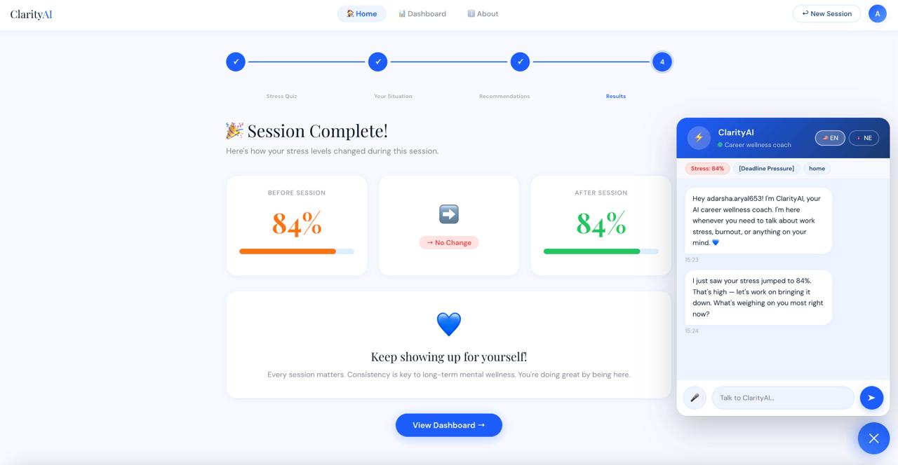

# ClarityAI — AI Career Wellness Platform

> An AI-powered career wellness platform that helps working professionals manage burnout, navigate stress, and find balance through context-aware coaching and CBT-backed techniques.


---



---

## How to Use

1. Clone the repo and open `index.html` in a browser
2. Sign up and take the **6-question stress assessment**
3. Describe your situation and select stressor tags
4. Get **personalized recommendations** based on your score
5. Chat with the AI coach — it knows your context
6. Take a **post-session assessment** to measure improvement
7. Visit the **Dashboard** to track your progress over time

---

## The Problem

Modern work demands constant connectivity and high output, leaving little room for mental recovery. Existing wellness apps offer generic meditation libraries — they don't understand your specific career context, deadlines, or workplace dynamics.

## Our Solution

ClarityAI is a **context-aware AI career coach** that:
- Knows your stress score, situation, and specific triggers
- Uses **CBT (Cognitive Behavioral Therapy)** techniques to challenge self-doubt and imposter syndrome
- Provides **measurable before/after stress reduction** per session
- Is always available as a floating chat companion across every page

---

## Features

### Session Flow
| Step | Feature | Description |
|------|---------|-------------|
| 1 | Stress Quiz | 6-question assessment covering sleep, workload, mood, social connection, anxiety, and energy — scored 0-100% |
| 2 | Your Situation | Describe your scenario, select stressor tags (Deadline Pressure, Imposter Syndrome, Manager Conflict, etc.), and identify self-doubt triggers |
| 3 | Personalized Recommendations | AI-generated suggestions based on your stress level — breathing exercises, music, humor, relaxation techniques |
| 4 | Post-Session Assessment | Retake the stress quiz after the session to measure real improvement |
| 5 | Session Results | Before vs after stress score comparison with visual progress indicator |

### AI Coach (Available Throughout)
| Feature | Description |
|---------|-------------|
| Context-Aware Chat | Gemini-powered chatbot that knows your stress score, situation, and specific triggers |
| CBT Techniques | Challenges self-doubt thoughts using cognitive reframing |
| Voice Support | Speak to the AI and hear responses via Web Speech API |
| Bilingual | English and Nepali language support |

### Dashboard & Analytics
| Feature | Description |
|---------|-------------|
| Session History | View all past sessions with dates and scores |
| Progress Graph | Line chart tracking stress reduction over time |
| Before/After Comparison | Visual comparison showing impact of each session |
| Aggregate Stats | Total sessions, average improvement, overall stress reduction |

### Platform
| Feature | Description |
|---------|-------------|
| User Authentication | JWT-based login with bcrypt password hashing |
| Persistent Storage | Data survives server restarts |
| Responsive Design | Works on desktop and mobile |

---

## Target Audience

**Primary:** Working professionals aged 22-40 in high-pressure roles (software engineers, product managers, consultants, founders) who experience work-related stress but won't seek formal therapy.

**Secondary:** College students facing academic pressure, exam anxiety, and imposter syndrome in competitive fields.

**Nepal-specific:** Mental health services are limited and stigmatized. ClarityAI provides a private, accessible alternative with Nepali language support.

---

## Tech Stack

| Layer | Technology |
|-------|-----------|
| Frontend | React 18 (CDN), Chart.js, Web Speech API, Canvas API |
| Backend | FastAPI, Uvicorn, Pydantic |
| AI | Google Gemini 2.5 Flash |
| Auth | PyJWT, bcrypt |
| Storage | JSON file (MVP) — upgradeable to PostgreSQL/MongoDB |

---

## Project Structure

```
ClarityAI/
├── index.html           # Complete frontend (single file, standalone)
├── main.py              # FastAPI backend (all routes + AI chat)
├── requirements.txt     # Python dependencies
├── .env                 # Environment variables (not committed)
├── db.json              # Persistent storage (auto-created)
└── README.md
```

---

## Setup & Installation

### Frontend Only (no backend needed)

```bash
open index.html
# or
npx serve . -p 3000
```

The AI chat will use the Gemini API directly from the browser as a fallback.

### Full Stack (frontend + backend)

```bash
# 1. Create virtual environment
python3 -m venv venv
source venv/bin/activate

# 2. Install dependencies
pip install -r requirements.txt

# 3. Configure environment
echo 'GEMINI_API_KEY=your_gemini_key' > .env
echo 'JWT_SECRET=your_secret_key' >> .env

# 4. Start the backend
python3 -m uvicorn main:app --reload --port 8000

# 5. Open index.html in your browser
open index.html
```

### Get a Gemini API Key (Free)

1. Go to [Google AI Studio](https://makersuite.google.com/app/apikey)
2. Click "Create API Key" → "Create project"
3. Copy the key (starts with `AIza...`)

---

## API Endpoints

| Method | Endpoint | Description | Auth |
|--------|----------|-------------|------|
| GET | `/` | API health check | No |
| POST | `/auth/register` | Create account | No |
| POST | `/auth/login` | Login, returns JWT | No |
| GET | `/auth/me` | Get current user | Yes |
| POST | `/stress/calculate` | Calculate stress score | Yes |
| POST | `/chat` | AI chat with context | Yes |
| POST | `/sessions` | Save session | Yes |
| GET | `/sessions` | Get user sessions | Yes |
| GET | `/sessions/stats` | Aggregate stats | Yes |

### Chat Request (Context-Aware)

```json
POST /chat
Authorization: Bearer <token>

{
  "messages": [{"role": "user", "content": "I'm stressed about my presentation"}],
  "language": "en",
  "stress_score": 78,
  "situation": "[Deadline Pressure, Imposter Syndrome] Big board presentation tomorrow",
  "reason": "Fear of not meeting expectations",
  "self_doubt": "What if they realize I don't know enough?",
  "session_history_summary": "3 sessions, avg reduction 20pts",
  "current_page": "home",
  "time_of_day": "evening"
}
```

The AI uses all this context to give specific, actionable advice — not generic responses.

---

## Privacy and Security

- Passwords are hashed with **bcrypt** (never stored in plain text)
- Authentication uses **JWT tokens** with configurable expiry
- API keys are stored in environment variables, not in source code
- User conversations are processed by Google Gemini AI and are not permanently stored
- All data stays local to the server (JSON file storage)
- No third-party analytics or tracking
- Users can request data deletion at any time

---

## Deployment (Vercel)

### Frontend

```bash
vercel --prod
# or drag-and-drop index.html at vercel.com/new
```

### Backend (Render / Railway)

```bash
# Render
# Build: pip install -r requirements.txt
# Start: uvicorn main:app --host 0.0.0.0 --port $PORT

# Railway
railway login && railway init && railway up
railway variables set GEMINI_API_KEY=your_key JWT_SECRET=your_secret
```

---

## What Makes ClarityAI Different

| | Generic Wellness Apps | ClarityAI |
|---|---|---|
| Approach | Pre-recorded meditation library | Context-aware AI that knows your specific situation |
| Input | Pick a category | Describe what's stressing you + select workplace triggers |
| Response | Same content for everyone | Personalized AI conversation with CBT techniques |
| Measurement | Streaks, minutes | Before/after stress scores with measurable reduction |
| Availability | Scheduled sessions | Always-on floating chat companion |
| Language | English only | English + Nepali |

---

## Team

| Name |
|------|
| Adarsha Aryal |
| Ashutosh Kr. Sah |
| Ravi |
| Saksham Khanal |
| Sweta Aryal |

*Nepal-US Hackathon 2026*

---

## License

MIT License — free to use, modify, and distribute.

---

*Built for working professionals who deserve better than "just breathe." Career stress is real — ClarityAI meets you in the moment.*
